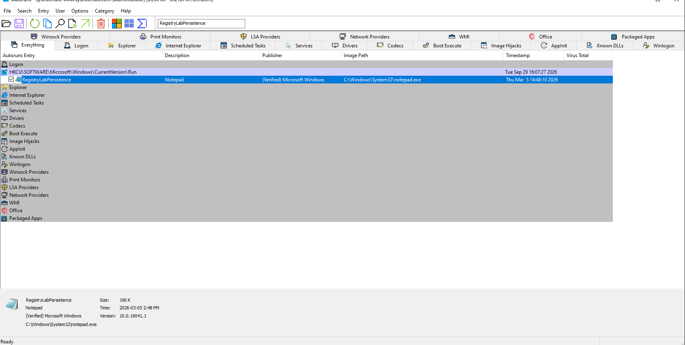
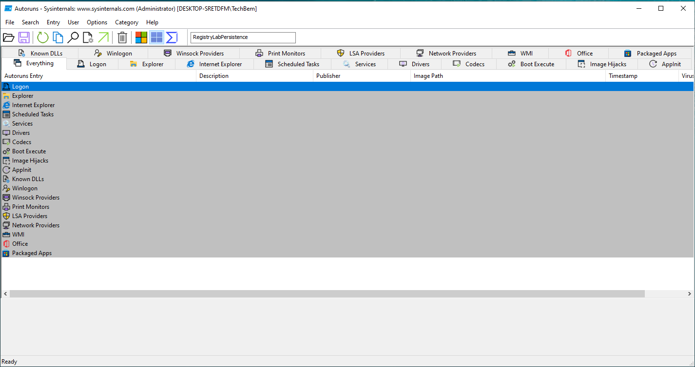

# Windows Registry Persistence Detection and Remediation Lab

## Overview

This hands-on Windows security lab demonstrates how a Registry Run key can establish user-level persistence, how the persistence mechanism can be identified using Microsoft Sysinternals Autoruns, and how to safely remove and verify the artifact.

The activity was completed in an isolated Windows virtual machine using `notepad.exe` as a harmless simulation. No malware or unauthorized software was used.

## Objectives

- Establish a clean system baseline
- Simulate a benign Registry-based persistence mechanism
- Detect the persistence entry using Sysinternals Autoruns
- Examine the associated Windows Registry Run key
- Remove the persistence mechanism
- Verify remediation through Registry, Autoruns, and logon testing
- Preserve sanitized investigation evidence
- Map the activity to the MITRE ATT&CK framework

## Lab Environment

| Component | Details |
|---|---|
| Operating system | Windows 10 virtual machine |
| Analysis tool | Microsoft Sysinternals Autoruns |
| Registry location | `HKCU\Software\Microsoft\Windows\CurrentVersion\Run` |
| Simulated application | `C:\Windows\System32\notepad.exe` |
| Persistence value | `RegistryLabPersistence` |
| MITRE ATT&CK technique | T1547.001 — Registry Run Keys / Startup Folder |
| Final result | PASS |

## Investigation Workflow

1. Created a recovery snapshot of the virtual machine.
2. Recorded the original Registry Run key state.
3. Generated a clean Autoruns baseline.
4. Created a harmless persistence entry using Notepad.
5. Confirmed that the Registry value existed.
6. Detected the entry using Sysinternals Autoruns.
7. Performed a logon test and confirmed that Notepad launched automatically.
8. Preserved the detection evidence.
9. Removed the persistence entry.
10. Verified that the Registry value was no longer present.
11. Verified that Autoruns no longer detected the entry.
12. Performed a final logon test.
13. Confirmed that Notepad no longer launched automatically.

## Detection Evidence

The screenshot below shows the simulated persistence entry detected by Sysinternals Autoruns.



## Remediation Evidence

The screenshot below confirms that the persistence entry was no longer present after remediation.



## Findings

- The Registry Run key caused the configured executable to launch during user logon.
- The entry was visible through both the Windows Registry and Sysinternals Autoruns.
- Removing the Registry value eliminated the persistence behavior.
- Post-remediation Registry, Autoruns, and logon checks confirmed successful removal.
- The final verification result was `PASS`.

## MITRE ATT&CK Mapping

| Category | Mapping |
|---|---|
| Tactic | Persistence |
| Technique | Boot or Logon Autostart Execution |
| Sub-technique | Registry Run Keys / Startup Folder |
| Technique ID | T1547.001 |

## Skills Demonstrated

- Windows Registry analysis
- Persistence detection
- Sysinternals Autoruns analysis
- Security baseline comparison
- Evidence collection and preservation
- Remediation verification
- MITRE ATT&CK mapping
- Incident investigation documentation
- Windows endpoint security

## Full Project Report

[View or download the complete PDF report](docs/Windows-Registry-Persistence-Lab-Report.pdf)

## Repository Structure

```text
windows-registry-persistence-lab/
├── README.md
├── docs/
│   ├── README.md
│   └── Windows-Registry-Persistence-Lab-Report.pdf
└── evidence/
    ├── README.md
    ├── 01-autoruns-persistence-detected.png
    └── 02-persistence-removed.png
```

## Security and Ethical Notice

This lab used a benign Windows executable inside an isolated virtual machine for defensive-security education. No malware, credential theft, unauthorized access, or destructive activity was performed.

## Status

- ✅ Lab completed
- ✅ Persistence detected
- ✅ Evidence collected
- ✅ Persistence removed
- ✅ Remediation verified
- ✅ Report completed
